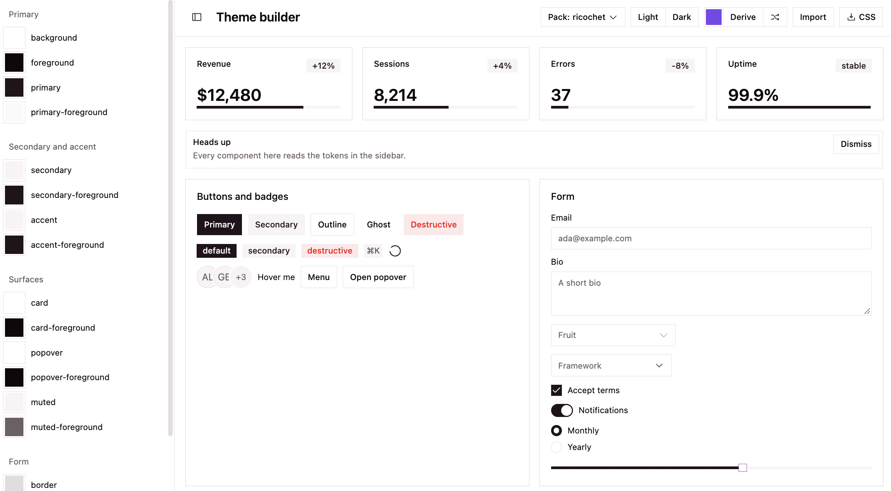

# basecoat

<!-- badges: start -->

[](https://github.com/ricochet-rs/basecoat/actions/workflows/R-CMD-check.yaml)
<!-- badges: end -->

Bindings to the [basecoat UI](https://basecoatui.com/) component library
from R.

Basecoat is a pure [tailwind css](https://tailwindcss.com/)
implementation of [shadcn/ui](https://ui.shadcn.com/) that is the very
same design system that powers [ricochet.rs](https://ricochet.rs).
Naturally, we’ve grown quite fond of it.

Every function is documented in the
[reference](https://ricochet-rs.github.io/basecoat/reference/index.html),
and every component is drawn in the [components
article](https://ricochet-rs.github.io/basecoat/articles/Components.html).

## Installation

``` r
install.packages("basecoat")
```

Or the development version from GitHub:

``` r
pak::pak("ricochet-rs/basecoat")
```

## Usage

`{basecoat}` is designed as an
[`htmltools`](https://rstudio.github.io/htmltools/) package that
generates raw HTML with *opt-in* shiny binding.

It works for creating HTML templates or with server-side-rendering (SSR)
with a framework like
[`{plumber2}`](https://posit-dev.github.io/plumber2/) or
[`{ambiorix}`](https://ambiorix.dev/) as well as an opt-in
[`{shiny}`](https://shiny.posit.co/) integration.

## Examples:

Basecoat is a framework agnostic package. These examples each build the
same kind of page on a different stack, with [HTMX](https://htmx.org/)
and [`{htmxr}`](https://hyperverse-r.github.io/htmxr/) doing the
swapping in the server rendered ones.

- [`{htmltools}` static html
  sidebar](https://github.com/ricochet-rs/basecoat/blob/main/inst/examples/sidebar-app.R)
- [`{shiny}` sidebar layout
  app](https://github.com/ricochet-rs/basecoat/blob/main/inst/examples/shiny-sidebar-app.R)
- [`{plumber2}` + `{htmxr}` for HTMX + Server Side Rendered (SSR)
  website](https://github.com/ricochet-rs/basecoat/blob/main/inst/examples/plumber2-htmx-basecoat.R)
- [`{nanonext}` SSR
  website](https://github.com/ricochet-rs/basecoat/blob/main/inst/examples/nanonext.R)

## Page Layouts

To help create full page applications, two page layout helps are
shipped:

- `bc_page_navbar()`
- `bc_page_sidebar()`

For servers that answer with HTML text rather than tags, `bc_page()`
writes the whole document as a string.

## Shiny integration

{basecoat} ships an optional shiny integration. Because `basecoat` is
not a shiny-only package, it must be opted into. Do this by calling
`bc_shiny_deps()` inside your top level UI component (or frankly
anywhere in your UI).

``` r
ui <- bc_page_navbar(
  bc_shiny_deps()
)
```

Below is an example of the `bc_page_sidebar()`.

<picture>
<source media="(prefers-color-scheme: dark)" srcset="man/figures/shiny-app-dark.png"/>

</picture>

Open an example application file with:

``` r
tmp <- tempfile(fileext = ".R")
fp <- system.file("examples", "shiny-app.R", package = "basecoat")
file.copy(fp, tmp)

file.edit(tmp)
```

## Custom themes

`bc_theme_builder()` can be used to launch a small html page to
customize your own theme. Alternatively, you can use the theme
customization in the [package
docs](https://ricochet-rs.github.io/basecoat/theme/index.html) to help

``` r
bc_theme_builder()
```

The theme builder can be used with any [tweakcn](https://tweakcn.com/)
theme.

Copy the example tweakcn theme and paste it into the “Import” button to
see how simple it is to customize your theme.

``` r
clipr::write_clip(
  brio::read_file(
    system.file(
      "examples/tweakcn-theme.css",
      package = "basecoat"
    )
  )
)
```

<picture>
<source media="(prefers-color-scheme: dark)" srcset="man/figures/ricochet-theme-dark.png"/>

</picture>

<picture>
<source media="(prefers-color-scheme: dark)" srcset="man/figures/random-theme-dark.png"/>

</picture>

### Importing themes

Set your theme by using the `bc_deps()` function. For SSR or normal
htmltools usage, `bc_deps()` inside your top level UI component, for
example here, it is `bc_page_sidebar()`. More on themes is in the
[theming
article](https://ricochet-rs.github.io/basecoat/articles/Theming.html).

``` r
bc_page_sidebar(
  bc_deps(
    style = "lyra",
    theme = system.file(
      "examples/tweakcn-theme.css",
      package = "basecoat"
    )
  ),
  title = "Production",
  sidebar = bc_sidebar(id = "sidebar"),
  header = bc_theme_switcher(id = "switcher"),
  div(
    class = "max-w-sm p-4",
    bc_card(
      bc_card_header(
        htmltools::h2("Production deploy"),
        htmltools::p("v1.4.2, 3m 12s"),
        bc_card_action(bc_badge("passed"))
      ),
      bc_card_body("All 128 checks green."),
      bc_card_footer("Deployed just now.")
    )
  )
)
```
