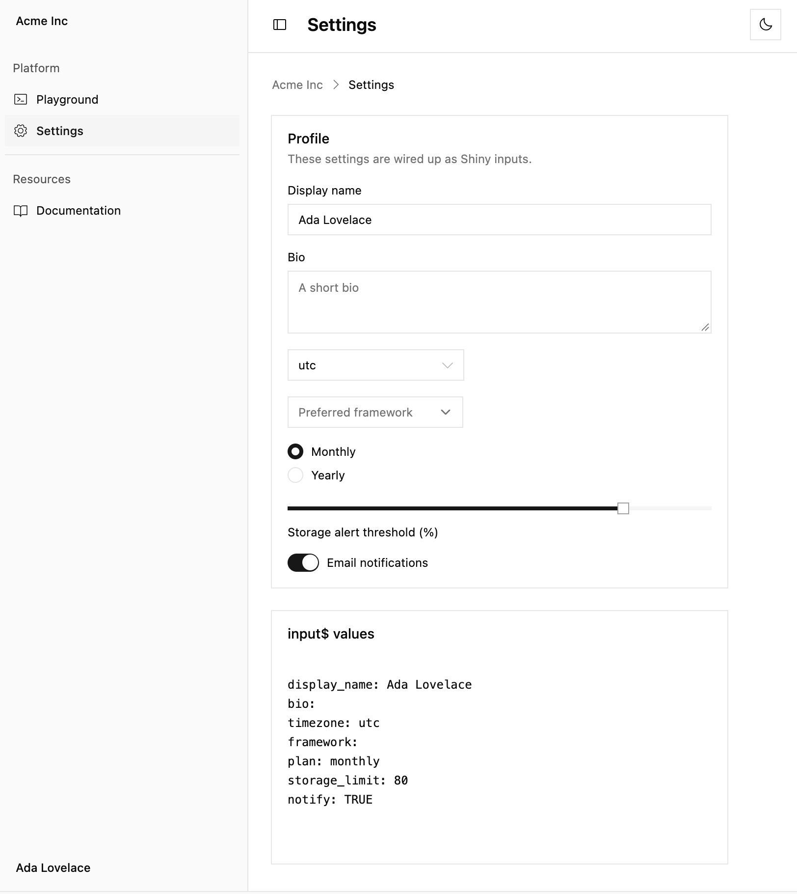
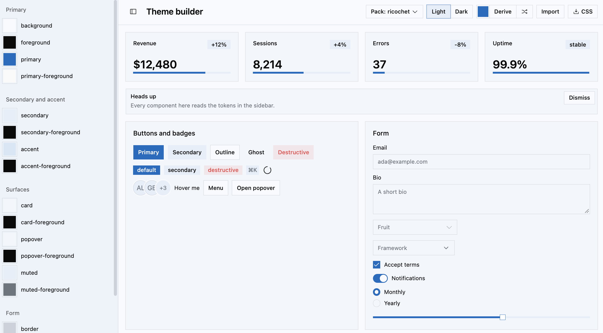

# basecoat

<!-- badges: start -->

[](https://github.com/ricochet-rs/basecoat/actions/workflows/R-CMD-check.yaml)
<!-- badges: end -->

Bindings to the [basecoat UI](https://basecoatui.com/) component library
from R.

Basecoat is a pure tailwind css implementation of
[shadcn/ui](https://ui.shadcn.com/) that is the very same design system
that powers [ricochet.rs](https://ricochet.rs). Naturally, we’ve grown
quite fond of it.

## Installation

``` r
pak::pak("ricochet-rs/basecoat")
```

## Usage

`{basecoat}` is designed as an `htmltools` package that generates raw
HTML with *opt-in* shiny binding.

It works for creating HTML templates or with server-side-rendering (SSR)
with a framework like `{plumber2}` or `{ambiorix}` as well as an opt-in
[`{shiny}`]() integration.

## Examples:

- [`{htmltools}` static html sidebar](./inst/examples/sidebar-app.R)
- [`{shiny}` sidebar layout app](./inst/examples/shiny-sidebar-app.R)

## Page Layouts

To help create full page applications, two page layout helps are
shipped:

- `bc_page_navbar()`
- `bc_page_sidebar()`

## Shiny integration

{basecoat} ships an optional shiny integration.

<picture>
<source media="(prefers-color-scheme: dark)" srcset="images/shiny-app-dark.png"/>

</picture>

Open an example application file with:

``` r
tmp <- tempfile(fileext = ".R")
fp <- system.file("examples", "shiny-app.R", package = "basecoat")
file.copy(fp, tmp)

file.edit(tmp)
```

## Theme builder

`bc_theme_builder()` can be used to launch a small html page to
customize your own theme. Alternatively, you can use the theme
customization in the [package
docs](https://ricochet-rs.github.io/basecoat/theme/index.html) to help

``` r
bc_theme_builder()
```

<picture>
<source media="(prefers-color-scheme: dark)" srcset="images/ricochet-theme-dark.png"/>

</picture>

<picture>
<source media="(prefers-color-scheme: dark)" srcset="images/random-theme-dark.png"/>

</picture>
